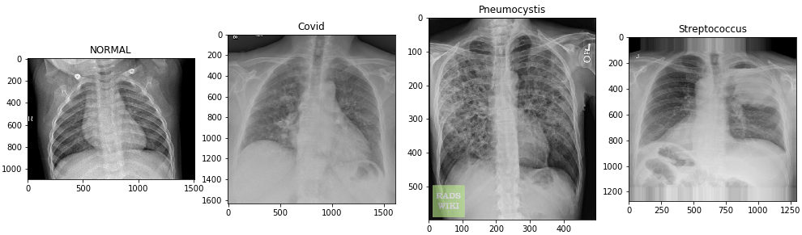

# Welcome to my personal webpage

https://atashnezhad.github.io/Amin-Atashnezhad/

I am currenlty a Post-doctoral fellow in Chemical and Petroleum Engineering at [Oklahoma State University](https://go.okstate.edu/) working on engineering modeling, optimziation and simulation. I am an aspiring data scientist.

Last two years I have been involved in developing an AI platform for autonomous drilling in geothermal wells which I developed a standalone software in python using tkinter library. 

I love astronomy, piano, and mechanical clocks and I am building one in my spare time.

Here is the list of the latest projects that I have been working on in the data science domain.

* [Lung disease detection using Deep learning](https://github.com/Atashnezhad/Lung_Disease_Detection_Deeplearning)

  

  This project is composed of two sub-projects including two class and four class classifications.
  Tensorflow library was used to develop deep convolutional networks. In the case of two-class classification, the balance data set was used however for the four-class classification, the total number of normal and covid were equal while the number of two other categories was under-balance. 
  The number of the other two classes were balanced taking the number of normal and covid cases into account and A generator was applied for generating new images. 
  In another approach, I used the weighted objective function for four-class classification to deal with imbalanced data set.
  The four-class classification codes were uploaded into the google collab to be ran using GPU. The results along with network visualization were provided.
  Both CNN models are able to classify the problems with good accuracy. Using a generator to increase the number of images is not suggested in general. Fluctuations in the validation data set accuracy versus iteration were observed. 

* [Binary Class Classification (NASA and Space) on Reddit data using NLP](https://github.com/Atashnezhad/Natural_language_processing_Project)

   The best model is the soft voting model including the three best ML algorithms which were achieved through grid search.
   In this project, a new set of data were extracted which later used for modeling. The analysis shows that a new engineered set of data (EDA) shows higher accuracy    and boosts the ML algorithms.
   Merging both vectorized text and Engineered data set (EDA) even helps more and boosts the accuracy above 80%.
   Finally having an ensemble model works the best with an accuracy of 96%
 

* [Frauds Detection Project](https://github.com/Atashnezhad/Frauds-Detection-Project)

    In this project, a set of data from Talking Data competition was used for two-class classification. Different ML algorithms were used for this purpose. The data was imbalanced therefore I used several approaches to deal with data including:

    * Oversampling
    * Batch reading
    * Customized approach: I filtered the data with a value of 1 out of 7 GB data and then count the same number of 0 values and added to base data. Results were a CSV file with 800k rows data points but balanced.
    * Selecting appropriate hyperparameters to deal with imbalanced data.
    
    The kernel was developed and was ran on kaggle cloud system here.

    In a seperate subproject, a python library for symbolic regression was used on sub-set data. The data normalized and was fed into the algorithm.

* [XGBoost Hyperparameters Tuning using Differential Evolution Algorithm](https://github.com/Atashnezhad/XGBoost_Hyperparameters_Tuning)

    In this project, the metaheuristic algorithm is used for tuning machine learning algorithms hyper-parameters. A fraud detection project from the Kaggle challenge is used as a base project. The Project composed of three distinct sections.

    * Metahurestic Algorithm (MA): 
      Differential Evolution Algorithm (DEA) selected as an intelligent searching tool. The DE Algorithm is work on top of the ML Algorithm (in this case XGBoost) to find the best set of hyper-parameters.
    * Machine Learning Algorithm: 
      The XGBoost which is a powerful machine learning algorithm is selected and the DEA is applied to find the best set of hyper-paratmers.
    * Final step: 
      The Tuned ML algorithm is applied to the Fraud detection challange (training, validation, and test). The results was promising and showed 89% accuracy on test data.
    In this notebook, we apply the Intelligent search methods like Differential Evolution Algorithm to find the best ML algorithm hyper-parameters. Previous options are using either predetermined or randomly generated parameters for the ML algorithms. Some of these searching methods are actually a simulation of Intelligent agents in nature like the folk of birds or school of fishes.

---

* A Clock inspired by Hisashige Tanaka a Japanese rangaku scholar 

  Hisashige was a Japanese rangaku scholar, engineer and inventor during the Bakumatsu and early Meiji period in Japan. In 1875, he founded what became the Toshiba Corporation. He has been called the "Thomas Edison of Japan" or "Karakuri Giemon." (Wikipedia)

  The following visualization in python shows my clock design for STILLWATER, OK, USA. The clock indexes dynamically shift based on the length of the day depending on the season. In summer more hours indexes show up at the top side of the clock which is representative of daylight, while during winter more hour indexes are seen at the lower side of the circle.

  
  

