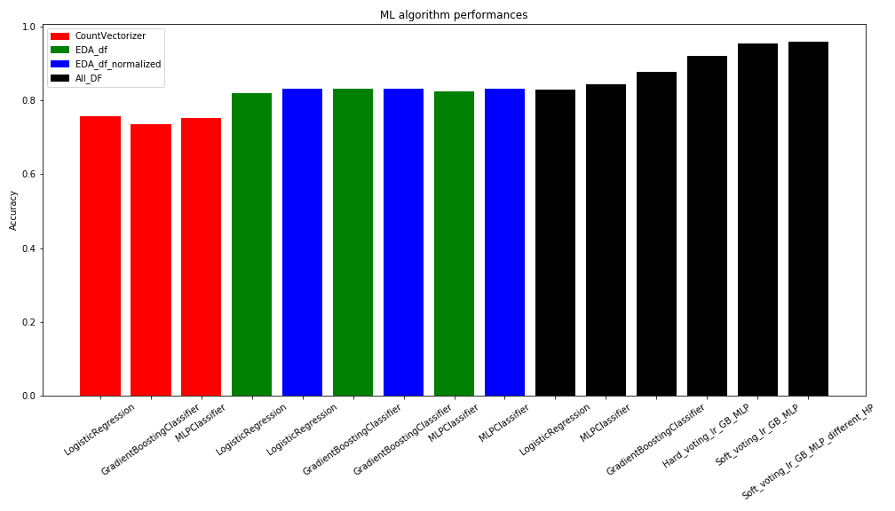

# Welcome to my personal webpage

I am currenlty a Post-doctoral fellow in Chemical and Petroleum Engineering at [Oklahoma State University](https://go.okstate.edu/) working on engineering modeling, optimziation and simulation. I am an aspiring data scientist.
Last two years I have been involved in developing an AI platform for autonomous drilling in geothermal wells which I developed a standalone software in python using tkinter library. 
I love astronomy, piano, and mechanical clocks and I am building one in my spare time.

Here is the list of the latest projects that I have been working on in the data science domain.

<!-- 
## [Developing PDC ROP model using symbolic regression algorithm](https://github.com/Atashnezhad/Machine-learning-to-develop-PDC-ROP-model)
In this project, the symbolic regression machine learning algorithm was used for developing a PDC ROP model.
The SALib library was used for sensitivity analysis and the first and second-order interactions between paramters are seen in the Figure below.

  

The Pysr clearly ignores the dimensionality of mathematical equations. The PySR guides the searching processes toward those equations which result in higher accuracy.
It would be beneficial if the ML algorithm (symbolic regression package) comes with new feathers to consider the dimensionality in the process of evolution.
One method that can be used for dimensionality consideration in PySR is by using a customized loss function. In such a case, it is suggested to develop a function that can measure the normalized behavior of separate input parameters into the dependant parameter. The influence of independent parameters on dependant parameters can be studied separately using lab data or from literature. For instance, there is almost an agreement that the WOB affects the ROP with power bigger than 1. Note that this is true before achieving the flounder point. Once the customized objective function was prepared, it is expected that the PySR incorporate more physics into developing equations.
The sensitivity analysis package in this study was used. As it is seen in the above graph, the PySR found that the WOB, RPM, and UCS have a bigger effect on ROP compare to Dc and NOC.
The results can be affected by the available number of data points too.
Besides the effect of independent parameters in dependant, One should consider the interaction effects. The interaction between independent parameters effectively affects how one independent parameter influences the dependant parameter.
For a problem with five independent parameters, the interaction between independent parameters can happen in the second-order, third-order, and fourth-order fashion ways. Therefore, from a statistical point of view, one should consider more than five independent parameters for modeling purposes. For a problem with five independent parameters, there are 206 interactions and for a 10D problem, there are more than 6M interactions (please check out the interaction calc Notebook in the directory).
The second-order interaction between independent parameters for this study is seen in the following figure. Statistics Analysis visualization was done using the SALib library. The below figure shows the contribution of each input to output parameters along with second-order as indices width.

-->

## [Lung disease detection using Deep learning](https://github.com/Atashnezhad/Lung_Disease_Detection_Deeplearning)

  

This project is composed of two sub-projects including two class and four class classifications.
Tensorflow library was used to develop deep convolutional networks. In the case of two-class classification, the balance data set was used however for the four-class classification, the total number of normal and covid were equal while the number of two other categories was under-balance. 
The number of the other two classes were balanced taking the number of normal and covid cases into account and A generator was applied for generating new images. 
In another approach, I used the weighted objective function for four-class classification to deal with imbalanced data set.
The four-class classification codes were uploaded into the google collab to be ran using GPU. The results along with network visualization were provided.
Both CNN models are able to classify the problems with good accuracy. Using a generator to increase the number of images is not suggested in general. Fluctuations in the validation data set accuracy versus iteration were observed (see below Figure). 

  

## [Binary Class Classification (NASA and Space) on Reddit data using NLP](https://github.com/Atashnezhad/Natural_language_processing_Project)

In this project, NLP was applied for two-class classification purposes. The data were gathered from Reddit for two close subjects including space and NASA.
A new set of data were extracted which was later used for classification. 
The analysis shows that a new engineered set of data (EDA) shows higher accuracy and boosts the ML algorithms accuracy. 
Merging both vectorized text and Engineered data set (EDA) even helps more and boosts the accuracy above 80%. 
Finally having an ensemble model works the best with an accuracy of 96%. Comparison between different algorithm accuracies and type of data set used is seen in the following Figure.

  

## [Frauds Detection Project](https://github.com/Atashnezhad/Frauds-Detection-Project)

In this project, a set of data from Talking Data competition was used for two-class classification. Different ML algorithms were used for this purpose. The data was imbalanced therefore I used several approaches to deal with data including, oversampling, reading data in batch considering the machine RAM into account and then applying ensumple method using all developed train models, a customized appraoch where I filtered the data with a value of 1 out of 7 GB data and then count the same number of 0 values and added to base data. Results were a CSV file with 800k rows data points but balanced (now all 1 values are included and the ML algorithms can learn more effecintly) and lastly I selected appropriate hyperparameters to deal with imbalanced data. The kernel was developed and was ran on kaggle cloud system here.

In a seperate subproject, a python library for symbolic regression was used on sub-set data. The data normalized and was fed into the symbolic regression algorithm.

## [XGBoost Hyperparameters Tuning using Differential Evolution Algorithm - Frauds detection application](https://github.com/Atashnezhad/XGBoost_Hyperparameters_Tuning)

In this project, the metaheuristic algorithm is used for tuning machine learning algorithms hyper-parameters. A fraud detection project from the Kaggle challenge is used as a base project. The Project composed of three distinct sections.

* Metahurestic Algorithm (MA): 
  Differential Evolution Algorithm (DEA) selected as an intelligent searching tool. The DE Algorithm is work on top of the ML Algorithm (in this case XGBoost) to find the best set of hyper-parameters.
* Machine Learning Algorithm: 
  The XGBoost which is a powerful machine learning algorithm is selected and the DEA is applied to find the best set of hyper-paratmers.
* Final step: 
  The Tuned ML algorithm is applied to the Fraud detection challange (training, validation, and test). The results was promising and showed 89% accuracy on test data.
In this notebook, we apply the Intelligent search methods like Differential Evolution Algorithm to find the best ML algorithm hyper-parameters. Previous options are using either predetermined or randomly generated parameters for the ML algorithms. Some of these searching methods are actually a simulation of Intelligent agents in nature like the folk of birds or school of fishes.

## [Big Data Project using Pyspark in Docker](https://github.com/Atashnezhad/Fraud_Detection_Pyspark)

  

In this project, the [Kaggle Fraud detection challange](https://www.kaggle.com/c/talkingdata-adtracking-fraud-detection) was studied. A docker image of Pyspark along with the Jupyter Notebook was used. 

 

## A Clock inspired by Hisashige Tanaka a Japanese rangaku scholar 

I love mechanical clocks and this is my hobby project. 

Hisashige was a Japanese rangaku scholar, engineer and inventor during the Bakumatsu and early Meiji period in Japan. In 1875, he founded what became the Toshiba Corporation. He has been called the "Thomas Edison of Japan" or "Karakuri Giemon." (Wikipedia)

The following visualization in python shows my clock design for STILLWATER, OK, USA. The clock indexes dynamically shift based on the length of the day depending on the season. In summer more hours indexes show up at the top side of the clock which is representative of daylight, while during winter more hour indexes are seen at the lower side of the circle.

  
  

